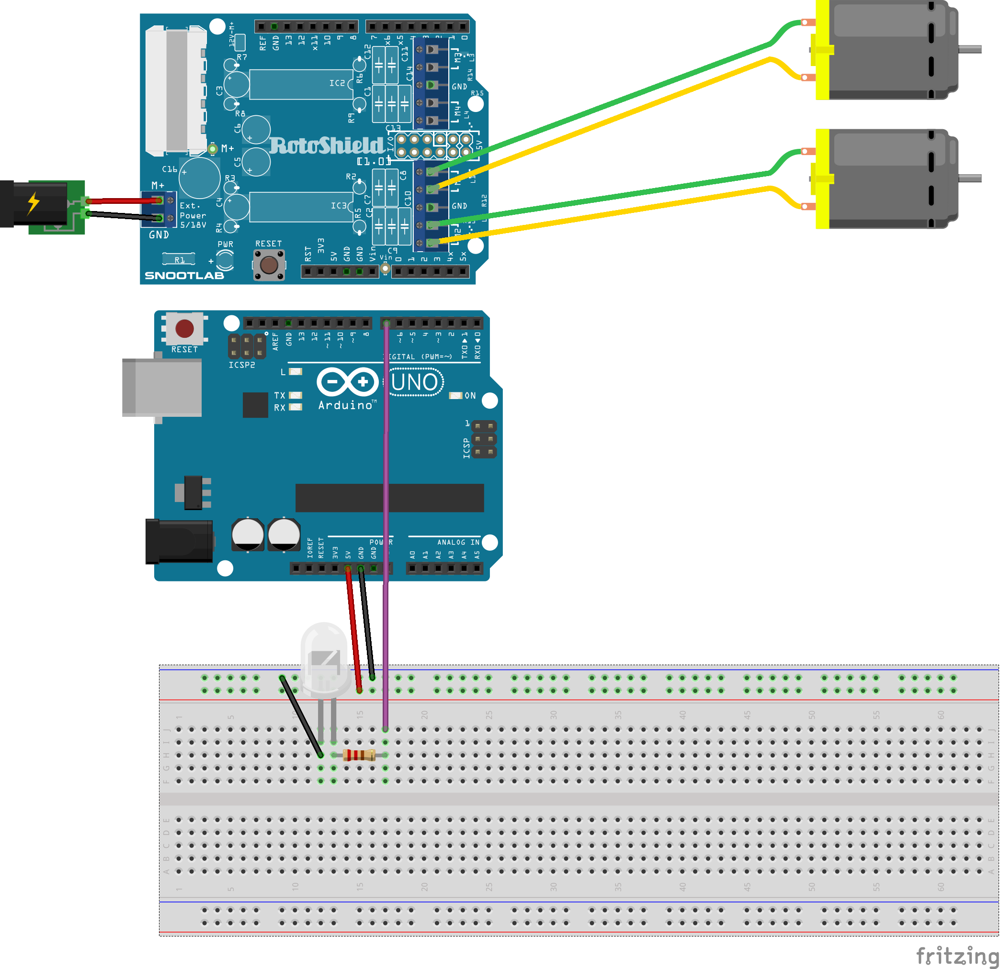
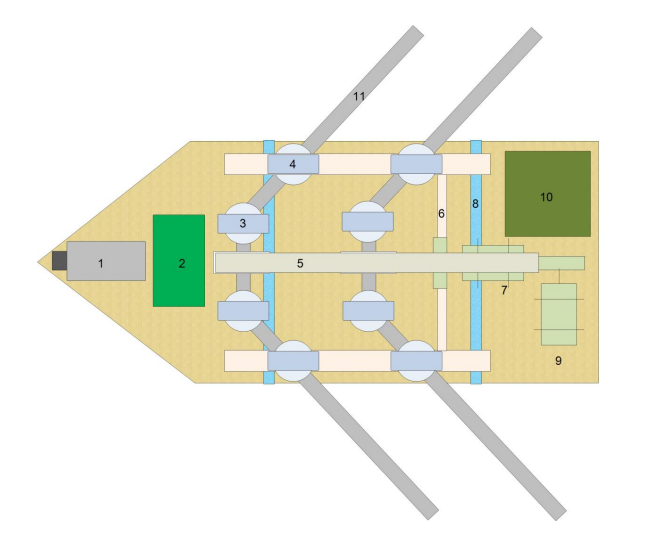

# 🛥️ Rescootert: Smart-Water Rescue Robot
**Legacy Project Archive | Ramon Magsaysay High School (STE Program)**

Rescootert is an amphibious, search-and-rescue robot prototype designed for flooded and unstable terrains. Developed during my time in the Science, Technology, and Engineering (STE) program, this project represents the foundation of my work in embedded systems and aquatic robotics.

> **⚠️ Archive Note:** This repository serves as a historical record of the project's development. As a legacy project from my high school years, the original source code is no longer available; however, full technical schematics, design logbooks, and research findings have been preserved here to demonstrate the engineering design process.

---

## 💡 Project Vision
Rescootert was designed to address the high-risk nature of water-based rescue operations during natural disasters. The goal was to create a sustainable, effective, and precise robotic tool that could navigate hazardous water conditions to scout locations or deliver emergency supplies.

* **Sustainable:** Designed for energy efficiency.
* **Effective:** Focused on high-buoyancy and structural stability.
* **Precise:** Utilized sensor-based navigation for obstacle avoidance.

---

## 🛠️ Hardware & Engineering Design
The project was built on the **Arduino** ecosystem, integrating mechanical design with electronic control.

* **Main Controller:** Arduino-based system for motor relay and sensor input.
* **Propulsion:** Dual DC motor configuration for high-maneuverability in water and muddy terrain.
* **Circuitry:** Detailed wiring for power distribution and sensor feedback (documented in schematics).

---

## 📂 Project Archive & Documentation
To preserve the integrity of the design process, the following assets are available in this repository:

### 📖 Technical Documentation
* **[Scanned Engineering Logbook](./documentation/Rescootert_Scanned%20logbook.pdf):** Original sketches, troubleshooting notes, and the day-to-day development timeline.
* **[AIMRaDC Technical Paper](./research/Rescootert_AIMRaDC.pdf):** The formal research abstract and technical description of the invention.
* **[Project Tarp](./documentation/Rescootert_tarp.png):** The official visual breakdown of the invention's features and mechanical layout.

### 🖼️ Engineering Visuals
* **Circuit Schematic:** Original wiring layout for the microcontrollers and motor drivers.

* **Mechanical Illustration:** Top-down component placement and structural design.

### 🎥 Media
* **[Video Presentation](./media/Rescootert_Videopresentation.mpeg):** A legacy demonstration showing the prototype's movement and functionality.

---

## 📈 The Evolution
Rescootert served as the direct predecessor to my later work in aquatic robotics, specifically **AquaNova** and **HydroSent**. The lessons learned in buoyancy, power management, and remote communication during this project formed the technical backbone of my current expertise in IoT, AI, and Robotics.

---
**Lead Inventor:** John Ivan P. Ello  
